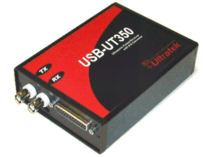

###Ultratekpy

Python Class for handling the USB-UT350 Ultrasonic Pulser/Receiver and 50 MHZ A/D Device for USB with DSP

see http://www.usultratek.com/products/usb_ut350.htm



Example of usage:

```python

import matplotlib.pyplot as plt
import numpy as np
import time

card = Ultratek()
handler = card.init()
if handler:
	card.setSamplingRate(6.25)
	card.setBufferLength(1800)
	card.setGain(40)
	card.setTriggerDelay(10)
	card.setADTriggerSource('software')


#Single acquisition mode
print  "Single acquisition mode"

card.softwareTrigger()

while card.isDataReady():    #Wait for the data to be available
	start = time.time()
    data = card.getData(1800)  #Discard initial garbage packet
    print (time.time() - start) * 1e3
	data = card.getData(1800)


plt.figure();
plt.plot(data);
plt.show()

```